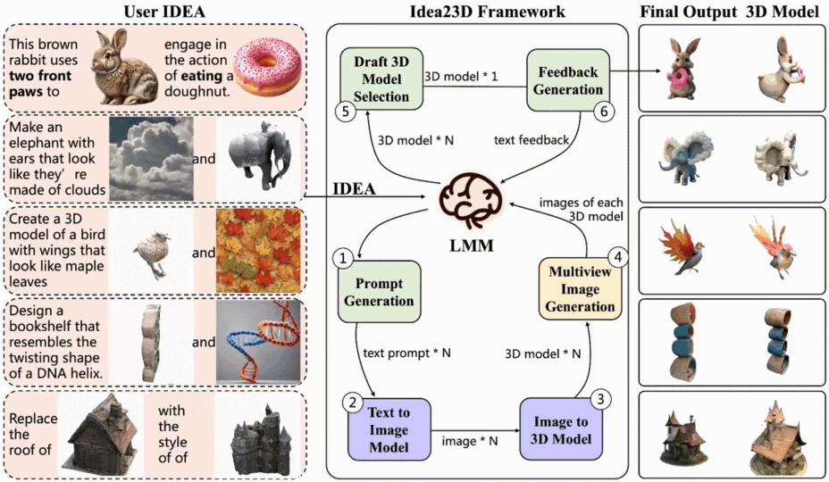

<h1 style="font-weight: bold">
  <!-- <a href="https://idea23d.github.io/" target="_blank"> -->
     <span style="background: linear-gradient(90deg, rgba(131,58,180,1) 0%, rgba(253,29,29,1) 50%, rgba(252,176,69,1) 100%); -webkit-background-clip: text; color: transparent; background-clip: text;">Idea23D</span>:
    Collaborative LMM Agents Enable 3D Model Generation from Interleaved Multimodal Inputs
  <!-- </a> -->
</h1>

2024.11: 🎉 Idea-2-3D has been accepted by COLING 2025! 🎉 See you in Abu Dhabi, UAE, from January 19 to 24, 2025!

<div align="left">
  <!-- <a href='https://idea23d.github.io/'>
    
  </a>&ensp; -->
  <a href="https://idea23d.github.io/"></a> &ensp;
  <a href="https://github.com/yisuanwang/Idea23D"></a> &ensp;
  <!-- <a href="https://colab.research.google.com/drive/1u_lJRvxIlBUPjC_Lou57SWLEnc5vLgQ6?usp=sharing"></a> &ensp; -->
  <a href="https://arxiv.org/abs/2404.04363"></a> &ensp;
   <a href="https://huggingface.co/yisuanwang/Idea23D"></a> &ensp;
  <a href="https://yisuanwang.github.io/Idea23D/gradiolink.html"></a> &ensp;
</div>


<a href="https://scholar.google.com/citations?hl=en&user=uVMnzPMAAAAJ" target="_blank">Junhao Chen *</a>,
<a href="https://scholar.google.com/citations?hl=en&user=_wyYvQsAAAAJ" target="_blank">Xiang Li *</a>,
<a href="https://scholar.google.com/citations?user=BKMYsm4AAAAJ&hl=en" target="_blank">Xiaojun Ye</a>,
<a href="" target="_blank">Chao Li</a>,
<a href="https://scholar.google.com/citations?user=JHvyYDQAAAAJ" target="_blank">Zhaoxin Fan †</a>,
<a href="https://scholar.google.com/citations?hl=en&user=ygQznUQAAAAJ" target="_blank">Hao Zhao †</a>

----

## ✨Introduction

Based on the LMM we developed Idea23D, a multimodal iterative self-refinement system that enhances any T2I model for automatic 3D model design and generation, enabling various new image creation functionalities togther with better visual qualities while understanding high level multimodal inputs.


## 📔Compatibility:
- LMM:
[OpenAI GPT-4V](https://community.openai.com/t/how-can-i-get-a-gpt4-api-key/379141), 
[OpenAI GPT-4o](https://community.openai.com/t/how-can-i-get-a-gpt4-api-key/379141), 
[llava-v1.6-34b](https://github.com/haotian-liu/LLaVA),
[llava-v1.6-mistral-7b](https://huggingface.co/liuhaotian/llava-v1.6-mistral-7b), 
[llava-CoT-11B](https://github.com/PKU-YuanGroup/LLaVA-CoT),
[InternVL2.5-78B](https://huggingface.co/OpenGVLab/InternVL2_5-78B),
[Qwen-VL2-8B](https://github.com/QwenLM/Qwen2-VL), 
[llava-CoT-11B](https://huggingface.co/Xkev/Llama-3.2V-11B-cot),
[llama-3.2V-11B](https://huggingface.co/meta-llama/Llama-3.2-11B-Vision), 
[intern-VL2-8B](https://huggingface.co/OpenGVLab/InternVL2-8B),

- Text-2-Image: 
[SD-XL 1.0 base+refiner](https://huggingface.co/docs/diffusers/en/using-diffusers/sdxl), 
[DALL·E](https://platform.openai.com/docs/guides/images?context=node), 
[Deepfloyd IF](https://huggingface.co/docs/diffusers/en/api/pipelines/deepfloyd_if),
[FLUX.1.dev](https://huggingface.co/black-forest-labs/FLUX.1-dev),

- Image-2-3D: 
[TripoSR](https://github.com/VAST-AI-Research/TripoSR), 
[Zero123](https://github.com/cvlab-columbia/zero123), 
[Wonder3D](https://github.com/xxlong0/Wonder3D),
[InstantMesh](https://github.com/TencentARC/InstantMesh), 
[LGM](https://github.com/3DTopia/LGM), 
[Hunyuan3D](https://github.com/Tencent/Hunyuan3D-1), 
[stable-fast-3d](https://huggingface.co/stabilityai/stable-fast-3d), 3DTopia, Hunyuan3D

## 🛠Run
The Gradio demo is coming soon, and you can also clone this repo to your local machine and run pipeline.py.
he main dependencies we use include: ```python 3.10, torch==2.2.2+cu118, torchvision==0.17.2+cu118, transformers==4.47.0, tokenizers==0.21.0, numpy==1.26.4, diffusers==0.31.0, rembg==2.0.60, openai==0.28.0```
These are compatible with gpt4o, instantMesh, hunyuan3d, sdxl, InternVL2.5-78B, and llava-CoT-11B.

```
pip install -r requirements-local.txt
```
You can add new LMM, T2I, and I23D support components by modifying the content under tool/api. An example of generating a watermelon fish is provided in idea23d_pipeline.ipynb.
Open [Idea23D/idea23d_pipeline.ipynb](./idea23d_pipeline.ipynb), Explore freely in the notebook ~ 
```
from tool.api.I23Dapi import *
from tool.api.LMMapi import *
from tool.api.T2Iapi import *


# Initialize LMM, T2I, I23D
lmm = lmm_gpt4o(api_key = 'sk-xxx your openai api key')
# lmm = lmm_InternVL2_5_78B(model_path='OpenGVLab/InternVL2_5-78B', gpuid=[0,1,2,3], load_in_8bit=True)
# lmm = lmm_InternVL2_5_78B(model_path='OpenGVLab/InternVL2_5-78B', gpuid=[0,1,2,3], load_in_8bit=False)
# lmm = lmm_InternVL2_8B(model_path = 'OpenGVLab/InternVL2-8B', gpuid=0)
# lmm = lmm_llava_CoT_11B(model_path='Xkev/Llama-3.2V-11B-cot',gpuid=1)
# lmm = lmm_qwen2vl_7b(model_path='Qwen/Qwen2-VL-7B-Instruct', gpuid=1)


# t2i = text2img_sdxl_replicate(replicate_key='your api key')
# t2i = t2i_sdxl(sdxl_base_path='stabilityai/stable-diffusion-xl-base-1.0', sdxl_refiner_path='stabilityai/stable-diffusion-xl-refiner-1.0', gpuid=6)
t2i = t2i_flux(model_path='black-forest-labs/FLUX.1-dev', gpuid=2)


# i23d = i23d_TripoSR(model_path = 'stabilityai/TripoSR' ,gpuid=7)
i23d = i23d_InstantMesh(gpuid=3)
# i23d = i23d_Hunyuan3D(mv23d_cfg_path="Hunyuan3D-1/svrm/configs/svrm.yaml",
#         mv23d_ckt_path="weights/svrm/svrm.safetensors",
#         text2image_path="weights/hunyuanDiT")
```
If you want to test on the dataset, simply run the pipeline.py script, for example:
```
python pipeline.py --lmm gpt4o --t2i flux --i23d instantmesh
```

## Evaluation dataset

1. Download the required dataset `dataset` from [Hugging Face](https://huggingface.co/yisuanwang/Idea23D).
2. Place the downloaded `dataset` folder in the path `Idea23D/dataset`.

```
cd Idea23D
wget https://huggingface.co/yisuanwang/Idea23D/resolve/main/dataset.zip?download=true -O dataset.zip
unzip dataset.zip
rm dataset.zip
```
Ensure the directory structure matches the path settings in the code for smooth execution.


## 🗓ToDO List
✅1. Release Code

⚪2. Support for more models, such as SD3.5, CraftsMan3D, and more.


## 📜Citations
```
@article{chen2024idea23d,
  title={Idea-2-3D: Collaborative LMM Agents Enable 3D Model Generation from Interleaved Multimodal Inputs}, 
  author={Junhao Chen and Xiang Li and Xiaojun Ye and Chao Li and Zhaoxin Fan and Hao Zhao},
  year={2024},
  eprint={2404.04363},
  archivePrefix={arXiv},
  primaryClass={cs.CV}
}
```


## 🧰Acknowledgement
We have intensively borrow codes from the following repositories. Many thanks to the authors for sharing their codes.

[llava-v1.6-34b](https://github.com/haotian-liu/LLaVA),
[llava-v1.6-mistral-7b](https://huggingface.co/liuhaotian/llava-v1.6-mistral-7b), 
[llava-CoT-11B](https://github.com/PKU-YuanGroup/LLaVA-CoT),
[InternVL2.5-78B](https://huggingface.co/OpenGVLab/InternVL2_5-78B),
[Qwen-VL2-8B](https://github.com/QwenLM/Qwen2-VL), 
[llava-CoT-11B](https://huggingface.co/Xkev/Llama-3.2V-11B-cot),
[llama-3.2V-11B](https://huggingface.co/meta-llama/Llama-3.2-11B-Vision), 
[intern-VL2-8B](https://huggingface.co/OpenGVLab/InternVL2-8B),
[SD-XL 1.0 base+refiner](https://huggingface.co/docs/diffusers/en/using-diffusers/sdxl), 
[DALL·E](https://platform.openai.com/docs/guides/images?context=node), 
[Deepfloyd IF](https://huggingface.co/docs/diffusers/en/api/pipelines/deepfloyd_if),
[FLUX.1.dev](https://huggingface.co/black-forest-labs/FLUX.1-dev),
[TripoSR](https://github.com/VAST-AI-Research/TripoSR), 
[Zero123](https://github.com/cvlab-columbia/zero123), 
[Wonder3D](https://github.com/xxlong0/Wonder3D),
[InstantMesh](https://github.com/TencentARC/InstantMesh), 
[LGM](https://github.com/3DTopia/LGM), 
[Hunyuan3D](https://github.com/Tencent/Hunyuan3D-1), 
[stable-fast-3d](https://huggingface.co/stabilityai/stable-fast-3d),


## ⭐️ Star History

[](https://star-history.com/#yisuanwang/Idea23D&Date)
